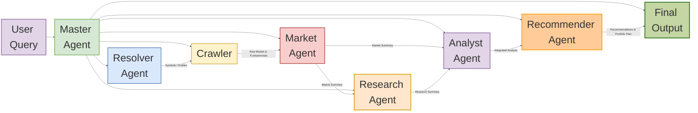

# 🔍 System Architecture Overview

This project implements a multi-agent financial intelligence platform designed to handle natural language investment queries.
It extracts relevant symbols, gathers market and qualitative data, performs deep analysis, and delivers personalized, actionable recommendations.

The system integrates crawler scripts, multiple LLM-driven agents, and external APIs to deliver high-quality insights for individual investors, analysts, and automated trading tools.

## 📊 Data Flow Diagram



## ⚙️ Agents Overview

### 1. User Query

* Can be **natural language**, e.g., "I want to invest in gold industry" or "invest in oil industry".
* Can also be **direct ticker symbols**, e.g., `AAPL`, `TSLA`.
* This input is sent to the Master Agent to start the workflow.

### 2. Master Agent

* Orchestrates the entire workflow.
* Passes data to all agents and handles errors/retries.
* Aggregates outputs for the Final Report.
* **Inputs**: User query
* **Outputs**: Final consolidated report

### 3. Resolver Agent

* Extracts tickers, sectors, and keywords from natural language queries or direct ticker inputs.
* Validates ticker symbols, detects typos, outdated symbols, and misspellings.
* Uses search tools such as **DuckDuckGo**, **Tavily**, and other market databases to ensure correctness.
* Sends only verified symbols to the Crawler.

**Example Output (with updated tickers and misspell handling):**

```json
{
  "symbols": ["AAPL", "MSFT", "META", "TSLA", "KIND"],
  "entities": ["technology", "software", "social media", "automotive"],
  "updated_symbols": {
    "GOOG": "GOOGL",
    "FB": "META",
    "APPL": "AAPL",
    "KIND" : "NXDR" 
  },
  "confidence": 0.98
}
```

> **Explanation:**
>
> * User input may contain outdated symbols: `FB` (now `META`) or `GOOG` (now `GOOGL`) or `KINDS` (now `NXDR`).
> * User input may contain misspellings: `APPL` corrected to `AAPL`.
>   Resolver Agent automatically detects and corrects these issues.

### 4. Crawler

* Collects raw market and fundamental data from:

  * Yahoo Finance
  * Alpha Vantage
  * Finnhub
* Sends raw data only to Market Agent.
* **Security Feature:** If Python code is found in crawled data, it is ignored and not executed.

**Example Output:**

```json
{
  "AAPL": { "ohlcv": [...], "fundamentals": {...} },
  "MSFT": { "ohlcv": [...], "fundamentals": {...} }
}
```

### 5. Market Agent

* Normalizes and analyzes quantitative data.
* Produces:

  * Technical trends, volatility, anomalies
  * Clean summaries
* Sends output to Research Agent and Analyst Agent.

**Example Output:**

```json
{
  "AAPL": { "trend": "up", "volatility": 0.18, "signals": {"rsi": 62} }
}
```

### 6. Research Agent

The ResearchAgent enriches market summaries with qualitative insights.

**Responsibilities:**

* Use Market Summary as input.
* For each symbol:

  * Gather insights from ≥5 sources (news, analyst reports, regulatory updates, sector trends)
  * Identify key events, risks, opportunities
  * Produce structured, neutral report:

    * Section 1: Industry & Macro context
    * Section 2: Company-specific updates
    * Section 3: Risk and opportunity highlights

**Inputs**: Market Summary
**Outputs**: Structured research briefs

**Example Use:**

```python
research_agent = ResearchAgent()
report = research_agent.analyze(market_summary)
print(report)
```

### 7. Analyst Agent

* Integrates Market and Research summaries.
* Performs:

  * Valuation metrics (P/E, EV/EBITDA, growth)
  * Peer and sector comparison
  * Risk assessment and red-flag identification
* Produces integrated analysis for the Recommender Agent.

**Example Output:**

```json
{
  "rankings": ["AAPL", "MSFT", "META", "TSLA"],
  "valuations": { "AAPL": {"pe": 25.6, "growth": "high"} }
}
```

### 8. Recommender Agent

* Converts analysis into investment strategies.
* Generates:

  * Buy/Hold/Sell recommendations
  * Portfolio weights and allocation suggestions
  * Risk mitigation advice

**Example Output:**

```json
{
  "recommendations": [
    {"symbol": "AAPL", "action": "BUY", "weight": 0.35, "entry": "< 170"}
  ]
}
```

## 🌟 Features

* Master-led orchestration
* Strict data flow separation
* Quantitative + qualitative integration
* Portfolio-aware recommendations
* Structured outputs (JSON + Markdown)
* Robust error handling and logging
* Ignores Python code in outputs or crawled data for security reasons; LLMs extract information directly without execution
* Handles both natural language queries and direct ticker inputs
* Detects typos, outdated symbols, and misspellings
* Updates tickers using DuckDuckGo, Tavily, and other search tools
* Returns `updated_symbols` mapping when symbols have changed or were misspelled, e.g., `FB` → `META`, `GOOG` → `GOOGL`, `APPL` → `AAPL`

## 🛠 Technology Stack

* Python 3.10+
* LLM APIs: Groq, Qwen, **Llama-3.3-70B-Versatile**, **Gemini-2.0-Flash**
* Market Data: Yahoo Finance, Alpha Vantage, Finnhub
* Search: DuckDuckGo, Tavily
* Visualization: Mermaid (architecture diagrams)

## 📈 Future Enhancements

* Automated backtesting
* Expanded data sources (Bloomberg, TradingView)
* Options/derivatives support
* Interactive dashboards for insights
* Portfolio simulation and risk modeling
