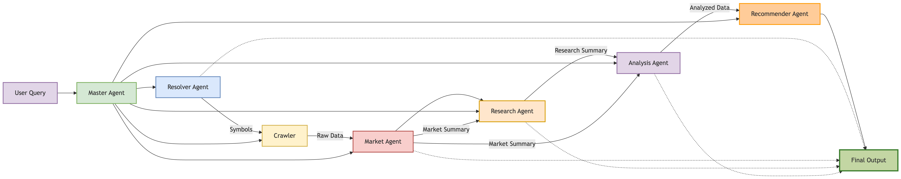

A multi-agent financial analysis system built using LangChain and FastAPI. Users can input a ticker symbol or a natural language query like "oil industry" or "gold industry". The system orchestrates multiple agents to fetch, analyze, and provide actionable financial insights.# Multi-agent-financial-analysis

🌟 Features
Natural Language Processing: Accepts both ticker symbols and natural language queries (e.g., "oil industry", "tech stocks")

Multi-Agent Architecture: Specialized agents for each stage of financial analysis

Real-time Data Integration: Gathers data from multiple financial sources (Yahoo Finance, Finnhub, Alpha Vantage)

Comprehensive Analysis: Technical, fundamental, and market sentiment analysis

RESTful API: FastAPI endpoint for easy integration

Intelligent Symbol Resolution: Automatically resolves company names to ticker symbols

🏗️ System Architecture

🚀 Quick Start
Prerequisites
Python 3.11+
API keys for:
Google Gemini API
Grok API
Tavily Search
Yahoo Finance API
Finnhub
Alpha Vantage

🧩 Agent Components
Master Agent
Orchestrates the entire analysis pipeline, managing workflow between specialized agents.

Resolver Agent
Uses DuckDuckGo Search and Tavily to resolve company names to accurate ticker symbols.

Crawler Agent
Gathers raw financial data from multiple sources:

Yahoo Finance (real-time quotes)

Finnhub (market data)

Alpha Vantage (historical data)

Market Agent
Analyzes overall market conditions, trends, and macroeconomic factors.

Research Agent
Conducts in-depth research on specific securities, including:

Financial statements

Industry positioning

Competitive analysis

Analysis Agent
Performs comprehensive analysis combining:

Technical indicators

Fundamental metrics

Sentiment analysis

Recommender Agent
Synthesizes all analyses to generate investment recommendations with confidence scores.