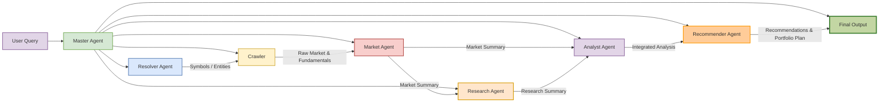

# 🔍 System Architecture Overview

This project implements a multi-agent financial intelligence platform designed to handle natural language investment queries.
It extracts relevant symbols, gathers market and qualitative data, performs deep analysis, and delivers personalized, actionable recommendations.

The system integrates crawler scripts, multiple LLM-driven agents, and external APIs to deliver high-quality insights for individual investors, analysts, and automated trading tools.

## 📊 True Data Flow Diagram



## ⚙️ Agents Overview

### 1. Master Agent
- Orchestrates the entire workflow.
- Passes data to all agents and handles errors/retries.
- Aggregates outputs for the Final Report.
- **Inputs**: User query  
- **Outputs**: Final consolidated report

### 2. Resolver Agent
- Extracts tickers, sectors, and keywords from natural language queries.
- Sends symbols only to the Crawler.

**Example Output:**
```json
{
  "symbols": ["XOM", "CVX", "OXY"],
  "entities": ["energy", "oil"],
  "confidence": 0.95
}
```

### 3. Crawler
- Collects raw market and fundamental data from:
  - Yahoo Finance
  - Alpha Vantage
  - Finnhub
- Sends raw data only to Market Agent.

**Example Output:**
```json
{
  "XOM": { "ohlcv": [...], "fundamentals": {...} },
  "CVX": { "ohlcv": [...], "fundamentals": {...} }
}
```

### 4. Market Agent
- Normalizes and analyzes quantitative data.
- Produces:
  - Technical trends, volatility, anomalies
  - Clean summaries
- Sends output to Research Agent and Analyst Agent.

**Example Output:**
```json
{
  "XOM": { "trend": "up", "volatility": 0.21, "signals": {"rsi": 58} }
}
```

### 5. Research Agent
The ResearchAgent enriches market summaries with qualitative insights.

**Responsibilities:**
- Use Market Summary as input.
- For each symbol:
  - Gather insights from ≥5 sources (news, analyst reports, regulatory updates, sector trends)
  - Identify key events, risks, opportunities
  - Produce structured, neutral report:
    - Section 1: Industry & Macro context
    - Section 2: Company-specific updates
    - Section 3: Risk and opportunity highlights

**Inputs**: Market Summary  
**Outputs**: Structured research briefs

**Example Use:**
```python
research_agent = ResearchAgent()
report = research_agent.analyze(market_summary)
print(report)
```

### 6. Analyst Agent
- Integrates Market and Research summaries.
- Performs:
  - Valuation metrics (P/E, EV/EBITDA, growth)
  - Peer and sector comparison
  - Risk assessment and red-flag identification
- Produces integrated analysis for the Recommender Agent.

**Example Output:**
```json
{
  "rankings": ["XOM", "CVX", "OXY"],
  "valuations": { "XOM": {"pe": 12.4, "growth": "moderate"} }
}
```

### 7. Recommender Agent
- Converts analysis into investment strategies.
- Generates:
  - Buy/Hold/Sell recommendations
  - Portfolio weights and allocation suggestions
  - Risk mitigation advice

**Example Output:**
```json
{
  "recommendations": [
    {"symbol": "XOM", "action": "BUY", "weight": 0.30, "entry": "< 108"}
  ]
}
```

## 🌟 Features
- Master-led orchestration
- Strict data flow separation
- Quantitative + qualitative integration
- Portfolio-aware recommendations
- Structured outputs (JSON + Markdown)
- Robust error handling and logging

## 🛠 Technology Stack
- Python 3.10+
- LLM APIs: Groq, Qwen
- Market Data: Yahoo Finance, Alpha Vantage, Finnhub
- Search: DuckDuckGo, Tavily
- Visualization: Mermaid (architecture diagrams)

## 📈 Future Enhancements
- Automated backtesting
- Expanded data sources (Bloomberg, TradingView)
- Options/derivatives support
- Interactive dashboards for insights
- Portfolio simulation and risk modeling
